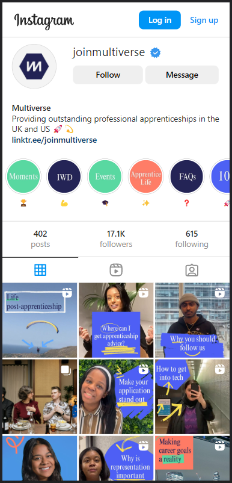

# Instagram Clone

**GOAL**: You have been tasked with creating an Instagram rival webpage for a company that wants to create a social media platform for professional photography. They have asked that it looks as close to Instagram as possible.

## Directions

Use your knowledge of html, flexboxes, DOM and event listeners to complete the following design tasks. It may help to do a sketch of your desired layout before you begin coding!

Here are URL's for random photographs to use:
Square Photos - https://picsum.photos/200
Feed Photos - https://picsum.photos/400/500

### Landing Page

The landing page should have a pseudo log in form.

### Feed Page

The feed page has a top and bottom navigation bar, along with an indefinite feed of images/videos with their usernames and captions.

### Account Page

The account page lays out the images in a wrapped row as opposed to a column. Along with a nav bar and User information in the header. That account page should show up when a user's name or profile image is clicked. For now, the content for this page should just be the same, regardless of who was clicked on.

## Done Early? Try These Stretch Exercises 🚀

1. Currently, you've worked with images only, try incorporating video content with audio.

2. Explore the CSS Grid properties and use them in your account page.

3. Have the account page be populated by an account you click on, as opposed to just the same data each time.
